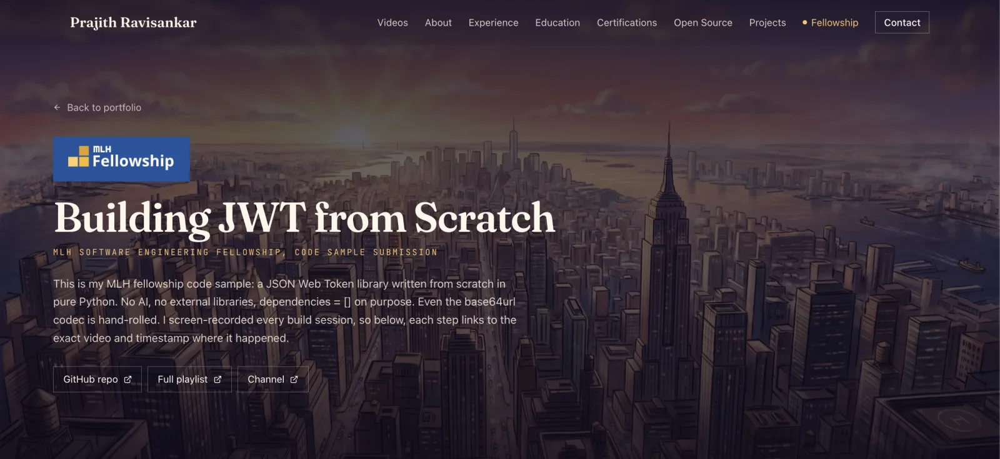

[](https://prajith-portfolio1.vercel.app)

# Portfolio — Prajith Ravisankar

Live at **[prajith-portfolio1.vercel.app](https://prajith-portfolio1.vercel.app)**.

A personal site built around commissioned illustration: eight full-bleed
artworks, one per section, with the layout of each section arranged around what
is actually in its picture rather than dropped on top of it.

## MLH Fellowship submission

The code sample for my MLH Software Engineering Fellowship application lives at
**[/mlh-swe-fellowship-submission](https://prajith-portfolio1.vercel.app/mlh-swe-fellowship-submission)**.

It documents a JSON Web Token library written from scratch in pure Python —
zero dependencies, hand-rolled base64url codec — with every build session
screen-recorded. Each step on the page links to the exact video and timestamp
where it happened, including the sessions where nothing worked.

## Stack

| | |
|---|---|
| Framework | Next.js 16 (App Router), React 19 |
| Language | TypeScript, strict |
| Styling | Tailwind CSS v4 |
| Components | shadcn/ui + Radix |
| Type | Fraunces (display), Instrument Sans (body), JetBrains Mono (data) |
| Hosting | Vercel |

## Running it

```bash
pnpm install
pnpm dev        # http://localhost:3000
pnpm build      # production build
pnpm lint
```

## How the code is organised

Content is separated from presentation throughout, so adding a project or a job
is a data edit rather than JSX surgery:

```
content/           typed data — profile, experience, education, projects,
                   certifications, open source, section artwork, the MLH log
components/
  portfolio/       reusable pieces, plus tokens.ts
  sections/        one component per page section
lib/               YouTube feed reader (RSS, no API key)
app/               routes: /, /videos, /mlh-swe-fellowship-submission
```

**`components/portfolio/tokens.ts` is the single source of truth for the visual
theme.** Every repeated class string lives there once, named by role rather than
by colour, so re-theming is one file rather than hundreds of scattered edits.

A few deliberate decisions worth knowing before changing things:

- **The "Day N" counter in the hero is live.** It is parsed from the most recent
  video title on the YouTube channel, so it increments itself on publish. If the
  feed is unreachable it is omitted rather than showing a stale number.
- **Video embeds are click-to-play facades.** Nothing loads a YouTube iframe
  until it is clicked — fifteen eager embeds on the MLH page would ship several
  megabytes of third-party player script.
- **Background music is opt-in and off by default.** Browsers block autoplay
  with sound anyway, and unexpected audio is a poor first impression. The audio
  element is not even mounted until the control is pressed.
- **Artwork is committed as WebP at three widths.** Source files are not in the
  repo; they are multi-megabyte originals that nothing serves.

## Credits

Music: [Ice Cream](https://links.al/06D) by
[Scott Buckley](https://www.scottbuckley.com.au/), licensed under
[CC BY 4.0](https://creativecommons.org/licenses/by/4.0/).
